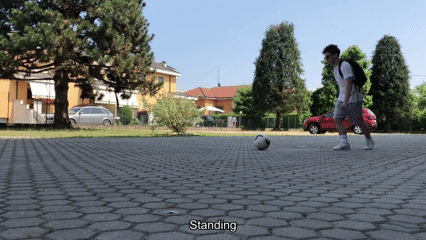
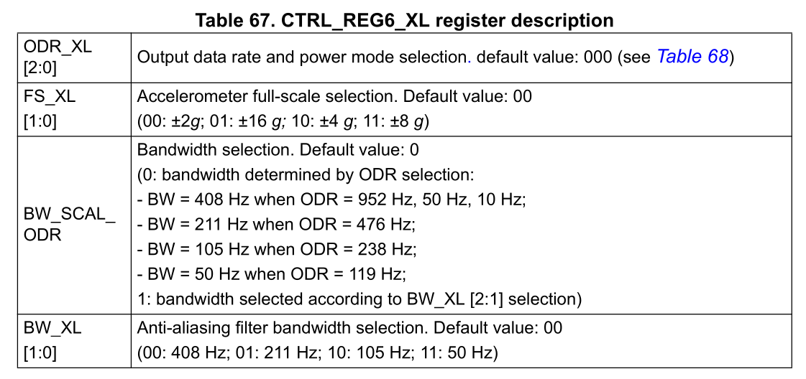
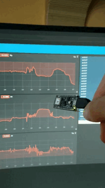
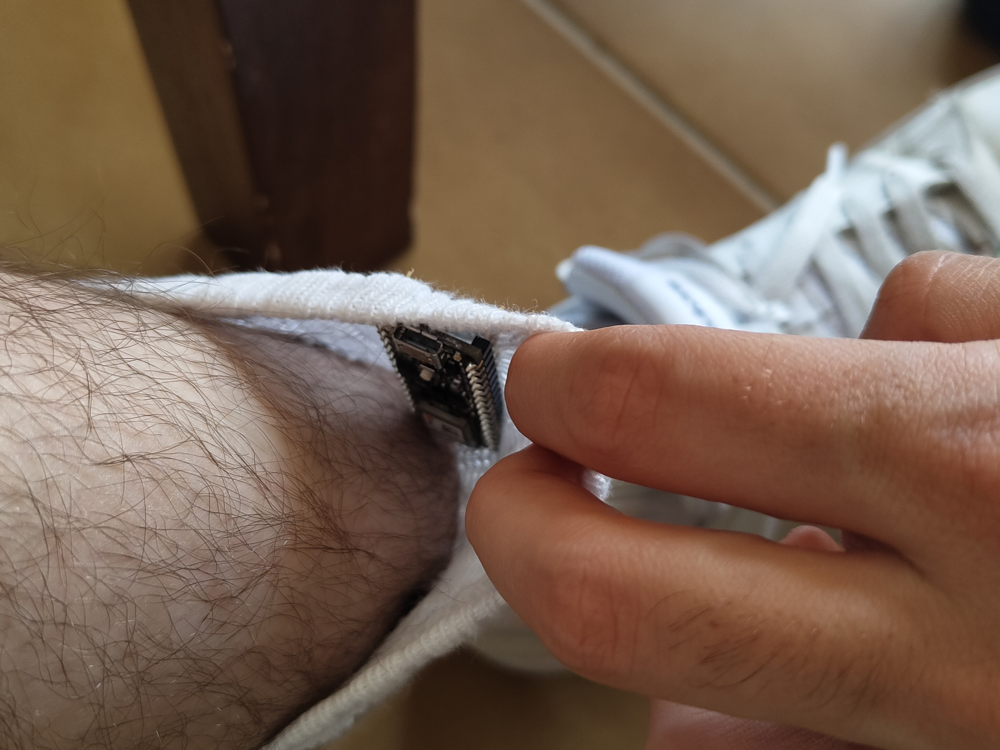
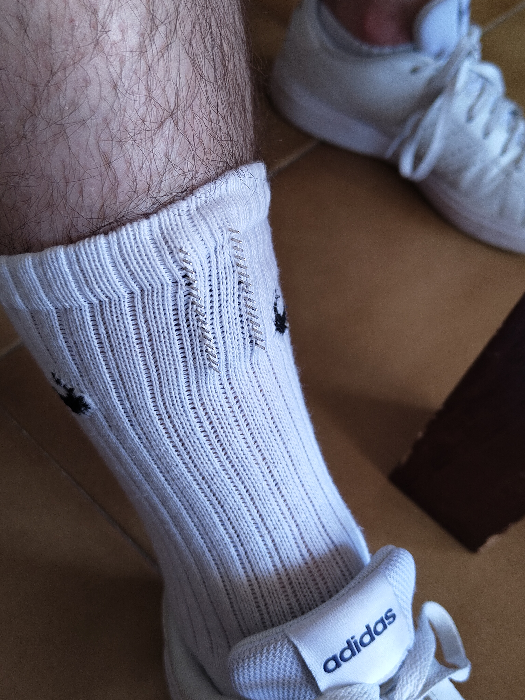
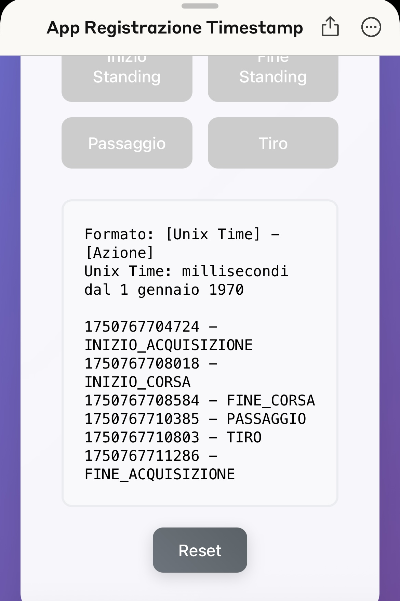
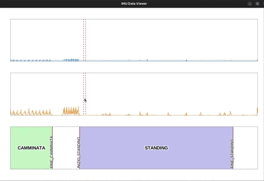
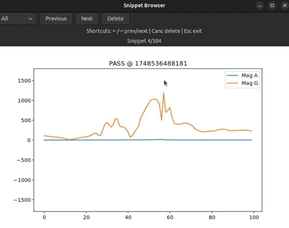
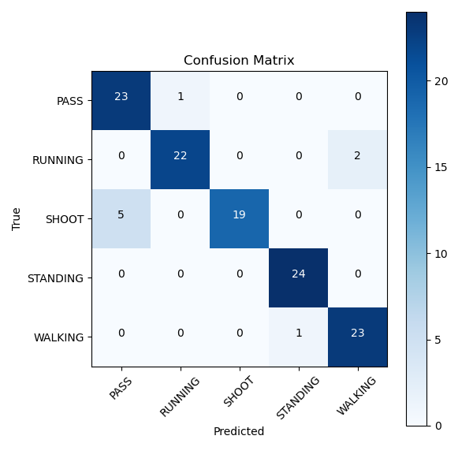

# MOTION – Movement Observation and Tracking through Intelligent Onboard Network

| _MOTION_ logo | Live classification |
|:-----------:|:-------------:|
|  |  |


## Overview

This project presents an advanced embedded Artificial Intelligence solution utilizing the Arduino Nano 33 BLE Sense to precisely classify football player activities in real-time. Specifically tailored for integration into sportswear, this system mounts directly onto a shin guard. By leveraging a locally executed neural network, the device can accurately identify and differentiate five primary football activities: **standing**, **walking**, **running**, **pass** and **shot**. The project was developed within the "Hardware Architectures for Embedded and Edge AI" course at Politecnico di Milano, with a strong emphasis on creating a high-performance, low-latency system suitable for practical sports applications.

This project demonstrates significant advancements in embedded AI solutions, effectively bridging the gap between theoretical AI models and practical, real-world deployment on wearable sports technology.

## Materials

* Arduino Nano 33 BLE Sense (for data collection and local inference)
* NVIDIA GPUs (for efficient AI model training)
* Laptop computer (for comprehensive data recording, management, and analysis)
* iPhone equipped with a custom-built web application tailored specifically for precise and intuitive real-time event marking
* Additional mounting hardware for secure attachment to shin guards

## Methods

Our methodology integrates diverse hardware, robust software, and intuitive mobile user interfaces in a comprehensive and seamless pipeline:

### Data acquisition

First of all, a modification to the LSM9DS1 library, the one driving the arduino's MPU, was necessary in order to get the full -16g|+16g range out from the accelerometer. The _LSM9DS1.cpp_ file was modified by changing the _hex_ value in the line
```C
writeRegister(LSM9DS1_ADDRESS, LSM9DS1_CTRL_REG6_XL, 0x70);
```
from **0x70** to **0x68**, which modifies the 8 bits representing the accelerometer settings appropriately, according to the table below, taken from the technical specification manual of the MPU in question.



A modification was made to three lines in _readAcceleration()_ function:
```C
  x = data[0] * 4.0 / 32768.0 / 0.163;
  y = data[1] * 4.0 / 32768.0 / 0.163;
  z = data[2] * 4.0 / 32768.0 / 0.163;
  ```
The division by **0.163** was added in order to get a range of accelerations going from 0 to 16, having "g" as the unit of measure.

Custom-developed firmware, written in Arduino C, was employed on the Arduino Nano 33 BLE Sense, capturing real-time data from the onboard 3-axis accelerometer and 3-axis gyroscope sensors at a high sampling rate of 100 Hz. Concurrently, a dedicated Python script was developed to run on an accompanying laptop, systematically recording this incoming sensor data along with Unix millisecond timestamps to facilitate precise synchronization and later data alignment.

<div style="display: flex; gap: 10px;">
  
  
  
</div>


### Event tracking

Real-time event marking was executed using a bespoke web application built using Claude AI technology, running smoothly on an iPhone. During data collection sessions, one engineer performed the football activities while the other observed the gameplay and manually annotated events by tapping the appropriate buttons on the phone interface. This process generated timestamped labels that aligned precisely with the sensor data, ensuring high accuracy and reliability during the subsequent labeling and training phases.

| Event tracking app interface | Output |
|:-----------:|:-------------:|
|  |  |

### Data processing and labeling

Post-acquisition, the raw sensor data underwent meticulous processing through a custom Python-based graphical interface utilizing GTK and Cairo libraries. This user-friendly interface allowed for precise graphical segmentation of data into one-second windows, each accurately labeled. Careful attention was given to ensuring data integrity and accuracy, resulting in a structured dataset partitioned into clearly defined subsets: 60% training, 20% validation, and 20% testing. Each action was sampled three times (centered, early, and late), and manual measures were carefully taken to prevent data leakage across training, validation, and testing splits.

| _SNIP SNIP_ software | Data view and edit |
|:-----------:|:-------------:|
|  |  |

### Model training

TensorFlow served as the foundational framework for neural network training. Data normalization was conducted as part of preprocessing to enhance model stability. The neural network architecture was specifically defined as follows:

```python
model = tf.keras.Sequential([
    tf.keras.layers.Conv1D(16, 3, activation='relu', input_shape=(X_train.shape[1], X_train.shape[2])),
    tf.keras.layers.MaxPooling1D(2),
    tf.keras.layers.Conv1D(32, 3, activation='relu'),
    tf.keras.layers.MaxPooling1D(2),
    tf.keras.layers.Conv1D(64, 3, activation='relu'),
    tf.keras.layers.Flatten(),
    tf.keras.layers.Dense(32, activation='relu'),
    tf.keras.layers.Dense(16, activation='relu'),
    tf.keras.layers.Dense(num_classes, activation='softmax')
])

model.compile(optimizer='adam',
              loss='sparse_categorical_crossentropy',
              metrics=['accuracy'])

# Early stopping callback
early_stop = tf.keras.callbacks.EarlyStopping(
    monitor='val_loss', patience=10, restore_best_weights=True
)

# Training
model.fit(X_train, y_train_i,
          validation_data=(X_val, y_val_i),
          epochs=100, batch_size=32,
          callbacks=[early_stop])
```

Despite rigorous testing of advanced augmentation and optimization techniques, the inherent variability and high quality of the collected dataset made complex augmentation largely unnecessary, thus the training prioritized simplicity and efficiency.

### Quantization and local inference

The trained neural network underwent quantization to 8-bit precision using TensorFlow Lite, resulting in a compact model size of only 63 kB. This quantization step was crucial, drastically reducing computational overhead while preserving accuracy. The quantized model facilitated direct, real-time inference on the Arduino hardware. A sliding window inference approach, utilizing one-second windows with half-second shifts, was implemented to achieve remarkably low inference latency, consistently measured at approximately 15–18 milliseconds, essential for real-time sports analytics.

## Quantitative results

The robustness and effectiveness of the trained neural network were rigorously evaluated, achieving a high test accuracy of 92.5%. Detailed confusion matrix analysis provided clear insights into model performance:




| Class    | Recall | Specificity | Precision | F1-score |
|----------|--------|-------------|-----------|----------|
| PASS     | 0.9583 | 0.9489      | 0.8214    | 0.8846   |
| RUNNING  | 0.9167 | 0.9896      | 0.9565    | 0.9361   |
| SHOOT    | 0.7917 | 1.0000      | 1.0000    | 0.8849   |
| STANDING | 1.0000 | 0.9896      | 0.9600    | 0.9796   |
| WALKING  | 0.9583 | 0.9792      | 0.9200    | 0.9388   |


## Final field test

The finalized model was thoroughly validated through extensive field testing in real football scenarios. Predictions were logged and synchronized with recorded video footage by converting them to subtitle file format, clearly demonstrating reliability and accuracy in practical gameplay environments. The project's success highlights its readiness for real-world sports analytics and athlete monitoring applications.

## GTK tools dependencies installation

_For Ubuntu users:_
```bash
sudo apt install libgirepository-2.0-dev gcc libcairo2-dev pkg-config python3-dev gir1.2-gtk-4.0
pip install pycairo PyGObject
```
_For Fedora users:_
```bash
sudo dnf install gcc gobject-introspection-devel cairo-gobject-devel pkg-config python3-devel gtk4
pip install pycairo PyGObject
```

## Data preparation and training workflow

* Run the scripts _snip_snip_gtk.py_ and _show_npy_gtk.py_ to create and visually inspect your data snippets.

* Execute _create_dataset.py_ to transform the created snippets into a structured dataset.

* Use the _norm_train.py_ script to normalize the data, train the model and evaluate performance.

* Finally, use _convert_to_lite.py_ to convert your trained model into a TensorFlow Lite Micro model and export it as a C array for embedded device deployment.


## Authors

* [Elia Falzoni](https://github.com/RogerTWS02)
* [Andrea Torti](https://github.com/AndreaTorti-01)
